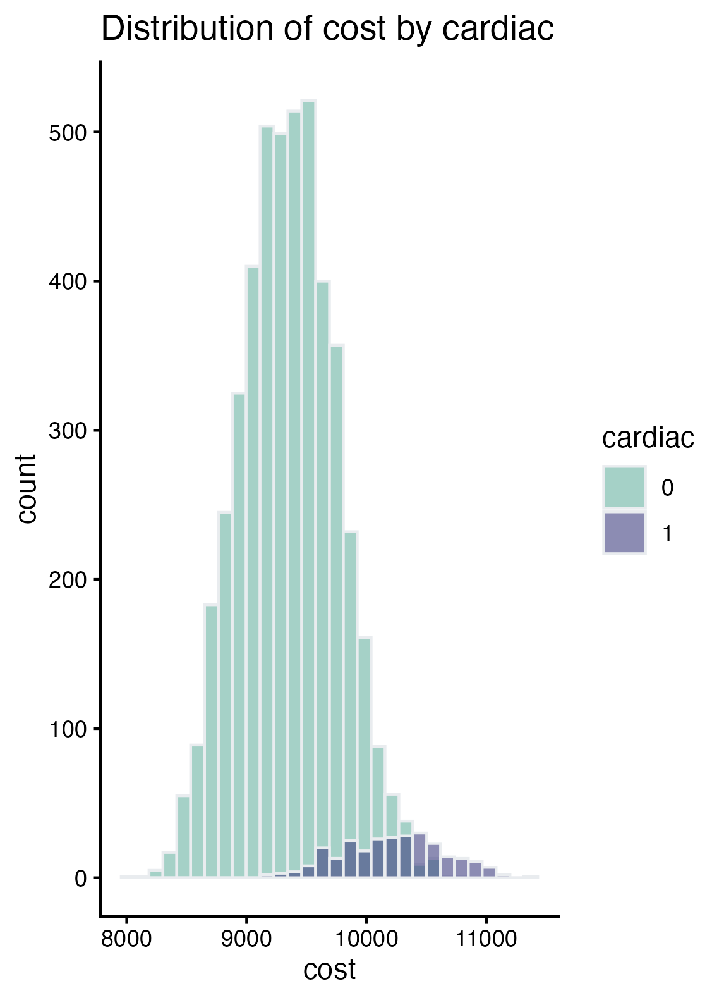

# Assignment #2 Repository

The csv file for `cohort` in the `raw-data` folder includes 5,000 observations with variables `smoke`, `female`, `age`, `cardiac`, and `cost`.

# Summary of findings:
I modeled the association between the cost and cardiac variables using a logistic 
regression and adjusted for age, sex, and smoke. Every 1 unit increase in cost is 
associated with a 1 fold increase in odds of cardiac. While cost appears reasonably
normally distributed, those with cardiac=1 have much higher cost on average.

# AI statement:
I did not use any generative AI technology to complete this assignment.

